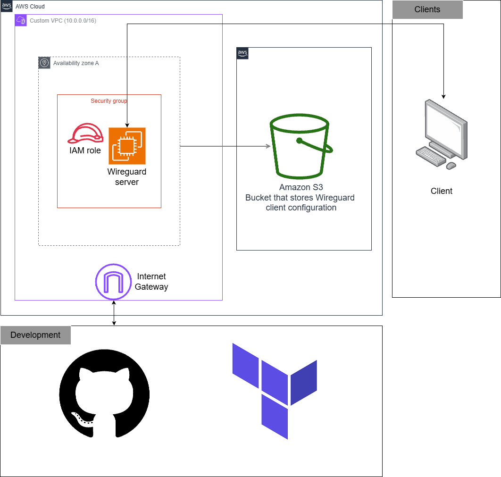
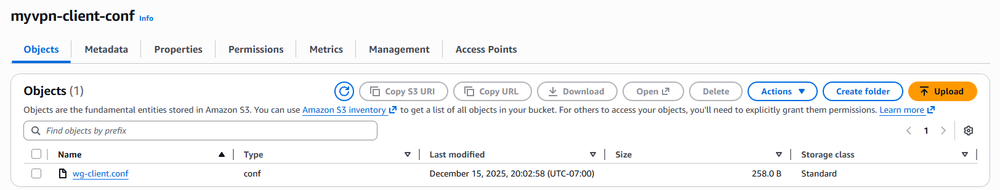
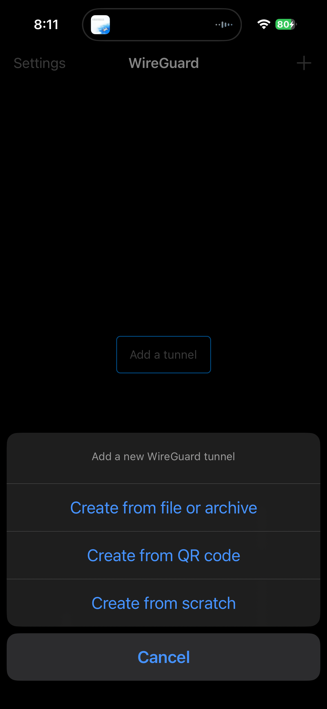
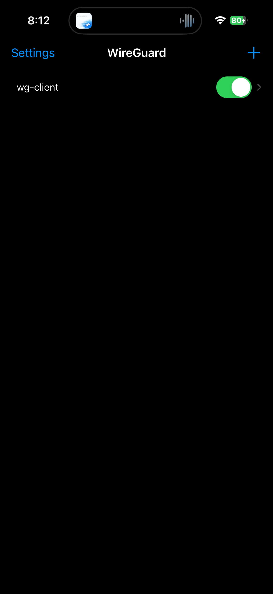

# MyVpn

Trying to make my own self hosted VPN with Terraform and Wireguard

## Details

MyVpn is a self-hosted VPN solution hosted on AWS that costs $0 thanks to their free tier. The VPN connection is private and secure, and easy to deploy thanks to Terraform.

The configuration for the VPN is stored in an S3 bucket that has SSE enabled. There is also minimal latency, as you can choose the region and availability zone that you deploy in.

## Architecture

MyVpn is deployed to AWS using Terraform and is composed of a small set of focused modules. The architecture is intentionally simple and optimized for a single WireGuard server that stores its client configuration in S3.

- **Terraform modules**: The deployment is driven by the Terraform modules in `terraform/modules` — `vpc`, `sg`, `s3`, `iam`, and `instance`. The root module (`terraform/main.tf`) wires these together.
- **Network**: A single VPC (`10.0.0.0/16`) with one public subnet (`10.0.1.0/24`) and an Internet Gateway. A public route table forwards 0.0.0.0/0 to the IGW so the instance can be reached and can access the Internet.
- **Security**: A security group (`wireguard_sg`) allows inbound UDP on WireGuard's default port (51820) from anywhere and allows all outbound traffic. This exposes the WireGuard UDP port to clients on the public Internet.
- **Compute**: A single EC2 instance (`t3.micro`) runs Ubuntu (Jammy) and is provisioned with a user-data script (`modules/instance/wireguard-user-data.sh`) that installs WireGuard, generates server and client keys, enables IP forwarding, configures iptables NAT, and starts `wg-quick@wg0`.
- **IAM & SSM**: An IAM role and instance profile are attached to the EC2 instance. The role includes the `AmazonSSMManagedInstanceCore` attachment so you can use SSM Session Manager to connect to the instance, and a custom policy granting `s3:PutObject` to the client-config S3 bucket so the instance can upload the generated client file.
- **Storage**: The client WireGuard config is uploaded to an S3 bucket named `myvpn-client-conf` which has server-side encryption (AES256) enabled. This is the primary distribution point for the client configuration.



### Operational flow:

1. Terraform provisions the VPC, subnet, route table, security group, S3 bucket, IAM role/profile, and the EC2 instance via the `instance` module.
2. On first boot (and after replacement, because `user_data_replace_on_change = true`), the EC2 instance's user-data script installs WireGuard, generates keys, and writes the server and client configs.
3. The script uploads the generated client configuration to the S3 bucket (`myvpn-client-conf`) using the IAM role's S3 permissions.
4. Optionally, you can reach the instance via SSM (Session Manager) for troubleshooting because the instance profile includes SSM permissions.

### Design notes:

- The setup exposes only the WireGuard UDP port; no SSH port is opened — SSM is used for administration instead of opening SSH.
- The client config is stored in S3 (instead of Parameter Store) to allow downloading the full file easily.
- This architecture is optimized for minimal cost and simplicity rather than high availability or multi-user scaling.

## Future Considerations

- Terraform state should be stored remotely. However, since this was a solo project, I didn't see a need to. If I did need to, I could create another S3 bucket or Terraform Cloud and store it there.
- Since this was a solo project, availability is not a big concern as I could always reapply my changes (althought not best practice) to restart my server.
- It's kind of a pain to have to grab the configuration file from S3 every time. Having some sort of UI to download the configuration would be nice.
- This only allows one person to connect to the VPN - Maybe a future project with Tailscale would be nice

## Getting the project working

In `terraform.tfvars.example` you will have to rename the file (or create a new one) named `terraform.tfvars`. Copy over the 2 lines, and insert the AWS region to deploy to and your AWS profile that you want to deploy the resources to.

1. You'll have to cd into the `terraform` folder first:

```bash
cd terraform
```

2. And then you can run the appropriate terraform workflow:

```bash
terraform validate
terraform plan
terraform apply
```

3. This step is optional, but just to see that it's working, since I have the SSM agent configured on the EC2 instance, you can use SSM to connect to it. Details to do that are in [Development Note 1](#development-note-1).

You can then run:

```bash
cat /var/log/user-data.log
```

And then you should see a log that says that the wireguard server was properly setup. For further validation you can run this:

```bash
sudo wg show
```

This will show you proof that wireguard is running and what the traffic status is. You can also see how many clients are connected

4. ~~You should be able to access the wireguard client config in parameter store now.~~ (I switched to S3. See [Development Note 4](#development-note-4))

If you go to Amazon S3, you should see a bucket named `myvpn-client-conf`. After the infrastrcuture was provisioned and the user data script ran, it should copy the Wireguard client configuration to S3.



Download this configuration file so that we can use it in our Wireguard Client application.

5. Install the Wireguard application either on the App or on your desktop

After installing the app, you can add the client configuration file by pressing the button in the top right:



After adding the wireguard config, you'll have to press `allow` to modify your VPN configuration. After pressing allow, you should be able to connect to your VPN by pressing the slider:



Now you have free, secure, and private internet access.

# Development Note

Things that I took note of when I was creating this project

## Development Note 1

In solar car one of my teammates (david) told me that his work used SSM to SSH into instances instead of opening a port for SSH as it is more secure. So, I decided that for this project I would try and configure the SSM agent on my wireguard instance.

After applying the plan, you can use this command:

```bash
aws ssm describe-instance-information
```

And you should get a response like this:

```bash
{
    "InstanceInformationList": [
        {
            "InstanceId": "i-xxxxxxxxxx",
            "PingStatus": "Online",
            "LastPingDateTime": "2025-12-11T19:31:07.841000-07:00",
            "AgentVersion": "3.3.3050.0",
            "IsLatestVersion": false,
            "PlatformType": "Linux",
            "PlatformName": "Amazon Linux",
            "PlatformVersion": "2023",
            "ResourceType": "EC2Instance",
            "IPAddress": "10.0.x.x",
            "ComputerName": "ip-10-0-x-x.ca-central-1.compute.internal"
        }
    ]
}
```

And then we can connect to the instance via SSM with this command:

```bash
aws ssm start-session --target i-xxxxxxxxxxxxxxxxxx

# after, you should get something like:

Starting session with SessionId: burton-37pjhgvsejb7d9vdfgd8rqeb4a
sh-5.2$
```

If you get a message saying that `SessionManagerPlugin` is not found (which happened to me), you have to install it. I installed it via scoop:

```bash
scoop bucket add extras (if not already added)
scoop install aws-session-manager-plugin
```

## Development Note 2

This line is so that when Terraform replaces the instance it will rerun the user data script. This is useful so that I don't have to tell it do that (although I will probably comment it out eventually once I'm done this project)

```
  user_data_replace_on_change = true
```

## Development Note 3

I'm still not 100% on the principle of least privilege or how to implement it at least...

For this role polciy to allow the EC2 instance to store in SSM parameter store, I defined the resource block as such, but I'm not sure if this is the best way to do so? If this ever comes up again I'll have to look into it again.

```
resource "aws_iam_role_policy" "ssm_parameter_store" {
  name = "ssm-parameter-store-access"
  role = aws_iam_role.ssm_role.id

  policy = jsonencode({
    Version = "2012-10-17"
    Statement = [
      {
        Effect = "Allow"
        Action = [
          "ssm:PutParameter",
          "ssm:GetParameter",
          "ssm:DeleteParameter"
        ]
        Resource = "arn:aws:ssm:*:*:parameter/wireguard/*"
      }
    ]
  })
}
```

## Development Note 4

This is my first time using parameter store. Since it doesn't really store files, and is more for storing strings, I think that S3 is the better use case here.
